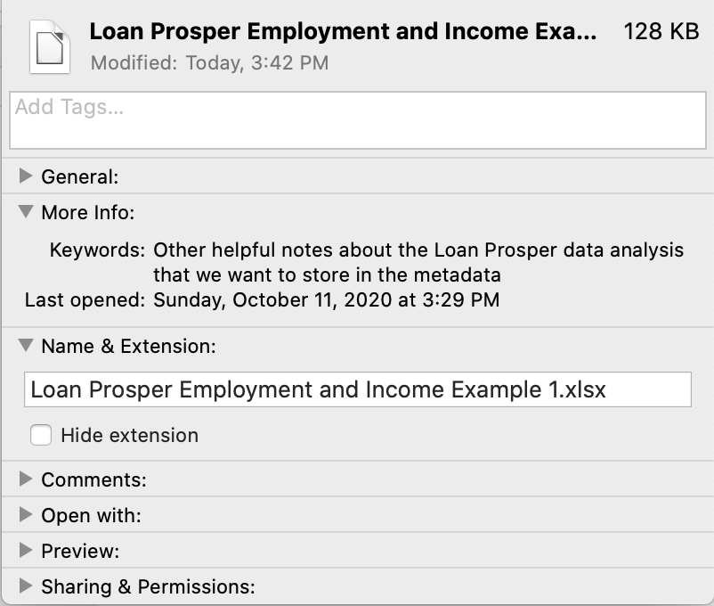

```{r setup, include=FALSE}
# Set RMarkdown options.
# Be sure to change the path so that it matches your desired working directory

knitr::opts_chunk$set(echo = TRUE)
```


# Objective

In this R-Ladies Dallas meetup tutorial, we will share R utilities for programmatically creating Excel workbooks within R, complete with colors, fonts, plots, and conditional formatting. 

Visit https://www.meetup.com/rladies-dallas to learn more about the R-Ladies Dallas chapter and to sign up for upcoming events.


# Setup 

First, let's load the packages we need for the tutorial. In this example, we suppress the messages that are normally displayed to the console during the package loads.

```{r}
# Load packages needed for the demol
suppressPackageStartupMessages(library(dplyr))
suppressPackageStartupMessages(library(tidyverse))
suppressPackageStartupMessages(library(tidyr))
suppressPackageStartupMessages(library(openxlsx))
```

&nbsp;

Set this to TRUE to automatically display the help info when running the cells below

```{r}
show_help = F
```

&nbsp;

For this demo, we will load the pre-processed loan dataset that we prepared in an earlier meetup. 

```{r}
# Import the dataset
dat_df = read.csv('data/loan_prosper_data_processed.csv')
```

&nbsp;

For the demo, we will select a few columns and prepare a few summary statistics. These will be used to generate the tables and visualizations we would like to insert into the Excel workbook.

```{r}
dat_summary = dat_df %>%
  # Select a few columns that we will focus on for the demo
  select(BorrowerState, EmploymentStatus, IsBorrowerHomeowner, StatedMonthlyIncome) %>%
  # Create binary indicators of whether or not the borrower was employed or a homeowner
  mutate(Employed = ifelse(EmploymentStatus == 'Employed', 1, 0),
         Homeowner = ifelse(IsBorrowerHomeowner == 'True', 1, 0)
         ) %>%
  # Group the records by state that the borrower lives in
  group_by(BorrowerState) %>%
  # Compute summary statistics for each of the borrower state subgroups
  summarise(
            # Number of loans in the borrower state
            NumLoans= n(),
            # These percentages are really decimals rounded to 4 places
            PercentEmployed = round(sum(Employed)/NumLoans, 4),
            PercentHomeowners = round(sum(Homeowner)/NumLoans, 4),
            # These income statistics are integer or decimal valued
            MinIncome = min(StatedMonthlyIncome),
            MedianIncome = median(StatedMonthlyIncome),
            MeanIncome = mean(StatedMonthlyIncome),
            MaxIncome = max(StatedMonthlyIncome)
            ) %>%
  # Ungroup the dataset (should be done after aggregations are done)
  ungroup %>%
  # Sort median income in descending order
  arrange(desc(MedianIncome)) 

# Display the resulting table
dat_summary %>% head(5)
```

&nbsp;

This code generates a horizontal bar chart of median income.

```{r}
dat_summary %>%
  ggplot(aes(x=BorrowerState, y=MedianIncome)) +
  geom_bar(stat='identity') +
  coord_flip() # This line converts it from a vertical to horizontal bar chart
```

# Examples {.tabset}

## Example #1: 

In this section, we provide a simple example that creates an Excel workbook featuring:

- Font colors, sizing, and other styles for the header
- Plots
- Multiple worksheets

&nbsp;

First, let's create the workbook object. This information will be recorded in the metadata associated with the file.

```{r}
if (show_help) ?createWorkbook

wb1 = createWorkbook(
  creator = 'Sydeaka Watson',
  title = 'Loan Prosper Dataset: Income and Employment Summary [Example 1]',
  subject = 'Other helpful notes about the Loan Prosper data analysis that we want to store in the metadata'
)
```

&nbsp;

Create a "style" that we can apply to the table header when we write data to the worksheet. This sample style uses the Times New Roman font (size 12). We will use a dark red background color and print the headers using bold, white text. All of the border lines (top, bottom, left, and right) will be drawn.

You have the option to specify numerous other styling features using the `createStyle` function.

```{r}
if (show_help) ?createStyle

style_header = createStyle(
  fontName = 'Times New Roman',
  fontSize = 12,
  fontColour = 'white',
  textDecoration = c('bold'),
  fgFill = 'darkred',
  border = 'TopBottomLeftRight'
)
```

&nbsp;

Before we add any content to the workbook, we must create a worksheet. Here, we create a sheet called `Summary` and add some data to it. Notice that we are applying the header formatting style we created above.

To accommodate columns that have longer or shorter values, we ask the `setColWidths` function to automatically determine the appropriate column widths. It generally does a good job. For more granular column width refinement, you could use the same function to manually set individual column widths.


```{r}
# Add worksheet
if (show_help) ?addWorksheet

sheet_name_for_summary = 'Summary'

addWorksheet(wb1, sheet_name_for_summary)


# Write data to the worksheet
if (show_help) ?writeData

writeData(wb1,
  sheet = sheet_name_for_summary,
  x = dat_summary,
  startCol = 1,
  startRow = 1,
  colNames = TRUE,
  headerStyle = style_header
)

# Automatically adjust column widths
setColWidths(wb1, sheet_name_for_summary, cols = 1:ncol(dat_summary), widths = "auto")
```

&nbsp;

Now that we have the data written to one sheet, let's create another sheet and insert a plot. This example uses the same `ggplot` code provided above. Note that you must generate the plot AND explictly print the plot immediately prior to using the `insertPlot` statement, or it won't work properly.


```{r}
# Add worksheet
sheet_name_for_plot = 'Income and Employment Plot'
addWorksheet(wb1, sheet_name_for_plot)

# Create the income plot and save as an R object
income_plot = dat_summary %>%
  ggplot(aes(x=BorrowerState, y=MedianIncome)) +
  geom_bar(stat='identity') +
  coord_flip()

# Before inserting the plot, we must display the plot using a print statement
print(income_plot)

# Insert the plot, and specify the size of the plot and the location (sheet name and row/col numbers)
insertPlot(wb1,
           sheet = sheet_name_for_plot,
           width = 6,
           height = 8,
           startRow = 2,
           startCol = 3)

if (show_help) ?insertPlot
```

&nbsp;

Almost done! All of the preceding operations make changes to the `wb` object, but we haven't created any Excel file yet. We must explicitly call the `saveWorkbook` function when we are ready to save the workbook.

```{r}
if (!dir.exists('output')) dir.create('output')
saveWorkbook(wb1, 
             file = 'output/Loan Prosper Employment and Income Example 1.xlsx', 
             overwrite = TRUE)
```

&nbsp;

Here's a snapshot of the file metadata. Note that the keyword section includes the note we specified in our call to the `createWorkbook` function.




## Example #2

In this section, we provide a simple example that creates an Excel workbook featuring:

- Font colors, sizing, and other styles for the header
- Font colors, sizing, and other styles for other part of the sheet aside from the header
- Two types of conditional formatting:
  - color scales
  - data bars


&nbsp;

First, let's create the workbook object. This information will be recorded in the metadata associated with the file.


```{r}
# Create the workbook
wb2 = createWorkbook(
  creator = 'Sydeaka Watson',
  title = 'Loan Prosper Dataset: Income and Employment Summary [Example 2]',
  subject = 'Loan Prosper Dataset'
)
```

&nbsp;

Create a "style" that we can apply to the table header when we write data to the worksheet. This sample style uses the Times New Roman font (size 12). We will use a dark red background color and print the headers using bold, white text. All of the border lines (top, bottom, left, and right) will be drawn.

Note that you have the option to specify numerous other features using the `createStyle` function.

```{r}
style_header = createStyle(
  fontName = 'Times New Roman',
  fontSize = 12,
  fontColour = 'white',
  textDecoration = c('bold'),
  fgFill = 'black',
  border = 'TopBottomLeftRight'
)
```


&nbsp;

Before we add any content to the workbook, we must create a worksheet. Here, we create a sheet called 'Loan Prosper Data Summary' and add some data to it. Notice that we are applying the header formatting style we created above.

To accommodate columns that have longer or shorter values, we ask the function to automatically determine the appropriate column widths. It generally does a good job. For more granular column width refinement, you could use the same function to manually set individual column widths.


```{r}
# Add worksheet
sheet_name_for_summary = 'Summary'
addWorksheet(wb2, sheet_name_for_summary)

# Write data to the worksheet
writeData(wb2,
  sheet = sheet_name_for_summary,
  x = dat_summary,
  startCol = 1,
  startRow = 1,
  colNames = TRUE,
  headerStyle = style_header
)

# Automatically set column widths
setColWidths(wb2, sheet_name_for_summary, cols = 1:ncol(dat_summary), widths = "auto")
```

&nbsp;

Next, we would like to apply two different types of conditional formatting to selected columns.

In this first snippet, we create a color scale that will color the `PercentEmployed` cells as red (lowest values), white (middle values), or green (highest values). 

```{r}
# Column ID number for the PercentEmployed field
col_id = which(colnames(dat_summary) == 'PercentEmployed')

if (show_help) ?conditionalFormatting

# These display the numeric values associated with the colors in the `style` parameter.
# This vector should be the same length as the `style` vector.
rule_markers = c(min(dat_summary$PercentEmployed), 
                 median(dat_summary$PercentEmployed), 
                 max((dat_summary$PercentEmployed))
                 )

# Apply the conditional formatting
conditionalFormatting(wb2, sheet_name_for_summary, 
                      cols = c(col_id), 
                      rows=2:(nrow(dat_summary)+1),
                      style = c("darkred", 'white', "green4"),
                      rule = rule_markers,
                      type = "colourScale")

```

&nbsp;

In our second conditional formatting example, we display data bars in the cells, where the lengths vary according to the magnitude of the `MedianIncome` values. 

```{r}
col_id = which(colnames(dat_summary) == 'MedianIncome')

conditionalFormatting(wb2, sheet_name_for_summary, 
                      cols = c(col_id), 
                      rows=2:(nrow(dat_summary)+1),
                      type = "databar", 
                      border = FALSE,
                      style = c('white', 'green4'),
                      rule = c(min(dat_summary$MedianIncome), max(dat_summary$MedianIncome))
                      )
```


&nbsp;

Next, we use the `addStyle` function implement additional styling to adjust the number formats in the spreadsheet. This impacts how the numbers are displayed in the cell without changing the values stored in our `data_summary` dataframe. We also incorporate styling that (1) displays the states (first column) using bold/italic font and (2) horizontally centers the text.

```{r}
# Column IDs for the columns with names ending in Income
income_cols = which(endsWith(colnames(dat_summary), 'Income'))

# Column IDs for the columns with names ending in Percent
percent_cols = which(startsWith(colnames(dat_summary), 'Percent'))

if (show_help) ?addStyle

# Display the income columns as CURRENCY, i.e., formatted as $XX.XX
addStyle(wb2, sheet_name_for_summary, 
         style = createStyle(numFmt = 'CURRENCY'),
         cols = income_cols, 
         rows=2:(nrow(dat_summary)+1),
         gridExpand = T
)

# Display the percent columns as PERCENTAGE, i.e, formatted as XX.XX%
addStyle(wb2, sheet_name_for_summary, 
         style = createStyle(numFmt = 'PERCENTAGE'),
         cols = percent_cols, 
         rows=2:(nrow(dat_summary)+1),
         gridExpand = T
)

# For the states in the first column, display the text in bold/italic and center the text.
# Note that the ids go from 2:(n+1) instead of 1:n so that we adjust for the column header row.
addStyle(wb2, sheet_name_for_summary, 
         style = createStyle(textDecoration = c('bold', 'italic'), halign = 'center'),
         cols = 1, 
         rows=2:(nrow(dat_summary)+1)
)

```


&nbsp;

Almost done! All of the preceding operations make changes to the `wb` object, but we haven't created any Excel file yet. We must explictly call the `saveWorkbook` when we are ready to save the workbook.

```{r}
if (!dir.exists('output')) dir.create('output')
saveWorkbook(wb2, 
             file = 'output/Loan Prosper Employment and Income Example 2.xlsx', 
             overwrite = TRUE)
```


